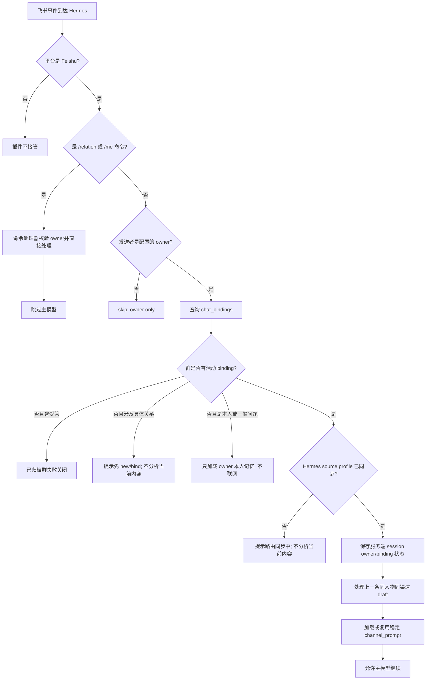
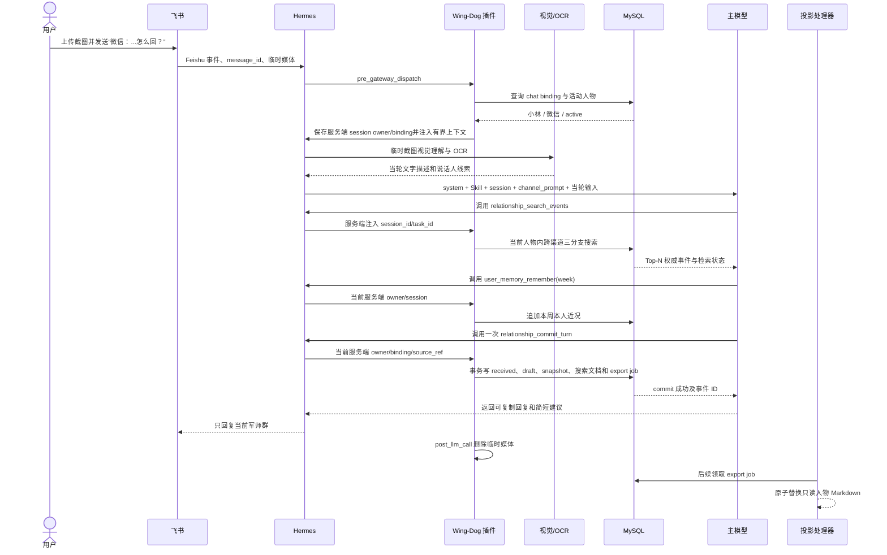

# 飞书关系消息端到端链路

本文解释一条飞书关系消息从进入 Hermes 到产生回复、按需核验公共信息、写入 MySQL、生成只读投影的完整过程，重点回答五个问题：

1. 系统里到底有哪几种“记忆”？
2. 每轮给模型加载了哪些上下文？
3. 群、人物、知识和旧记录分别怎么路由？
4. 哪些内容在什么时候写入，哪些内容不会写入？
5. 公网搜索何时允许、如何匿名化，结果与关系记忆有什么区别？

本文只描述当前仓库源码和离线测试能够证明的行为，不代表本机此刻的 MySQL、Hermes Gateway、飞书连接、计划任务或远程模型处于健康状态。文中的“小林”、群、消息和数据 ID 均为虚构示例。

## 先给结论

一条飞书消息不是“收到后立刻完整存进关系数据库”。实际链路是：

```text
飞书消息
  -> Hermes 建立或恢复短期 session
  -> 插件校验 owner、群路由和人物 binding
  -> 插件加载本人记忆与当前人物的有界上下文
  -> 模型按需搜索旧事件；必要时在绑定群匿名查询当前公共信息
  -> 模型读取 Skill 参考资料并形成建议
  -> 模型成功调用受控工具后，当前事件、草稿和快照才写入 MySQL
  -> MySQL 事务成功后排队生成只读 Markdown 投影
```

唯一常见的“模型调用前关系写入”是上一条未决草稿的发送状态：同一人物、同一渠道的下一条普通 owner 消息到达时，入口 hook 会先把上一条草稿追加为 `sent`；若本条明确说“没发”“未发送”“没采用”或“改了”，则追加一条 `correction`。斜杠命令不会触发这一规则。

当前消息里的新 `received`、本轮回复 `draft` 和关系快照不会仅因消息到达而自动写入。它们依赖模型成功调用 `relationship_commit_turn`。同样，模型没有成功调用 `user_memory_remember` 时，一句本人事实也不会仅因出现在聊天里就自动成为跨群个人记忆。

## 一、先区分三种记忆、两种派生数据和临时联网结果

日常说的“记忆”在这里至少包含三层。把它们混为一谈，就很容易误解 `/new`、跨群共享、人物隔离和 Markdown 投影。

| 层次 | 保存什么 | 作用域 | 何时加载 | 何时写入或更新 | 是否为关系权威源 |
| --- | --- | --- | --- | --- | --- |
| Hermes 短期 session | 当前会话消息、工具结果和宿主组装的模型上下文 | 当前飞书来源对应的 Hermes session | Hermes 建立或恢复 session 时 | 由 Hermes 宿主管理；本插件不定义其持久化 schema | 否 |
| owner 本人记忆 | 用户本人的身份、工作/学校、生活方式、偏好、目标和阶段性近况 | 同一 owner 跨飞书群共享 | 每个关系或通用群的上下文构建时 | `/me` 命令或模型调用本人记忆工具时 | 是，本人事实的权威源 |
| 人物关系记忆 | 某一人物的 profile、渠道、事件、草稿、快照和修正 | 一个 owner 下的单一人物；渠道状态继续隔离 | 已绑定关系群构建上下文或按需搜索时 | 关系命令、入口草稿规则或关系提交工具成功时 | 是，关系数据的权威源 |
| 检索文档和补强任务 | 权威事件原文副本/hash、检索摘要、概念、别名、实体和时间线索 | 跟随单一关系事件 | 只在搜索候选阶段使用 | 每个非 draft 事件写入时同步创建或排队 | 否，只是检索派生数据 |
| `.local/relationships/*.md` | profile 与完整事件时间线的只读审阅视图 | 单一人物文件 | Codex 或人工审阅时 | MySQL 事务后异步导出，或 `/relation export` 立即导出 | 否，不能反向覆盖 MySQL |
| 公网搜索结果 | DDGS 返回的网页标题、URL 和摘要 | 已绑定关系群的当前 Hermes session | 明确需要当前公共信息时 | 不持久化；只作为当轮 tool 消息 | 否，不是关系记忆或确认事实 |

### 1. Hermes 短期 session

Hermes session 负责让模型记得同一会话刚才聊了什么、调用了什么工具以及工具返回了什么。它不是本项目的关系数据库，也不能替代人物 binding。

发送 `/new` 会开始一个干净的模型会话，并清理该 session 对应的插件内存缓存；它不会删除 MySQL 中的本人记忆、人物 profile、渠道、事件、草稿、快照或投影任务。普通一轮结束只清理临时媒体和本轮指标，不会立即丢弃同一 session 的稳定提示缓存。

### 2. 跨群 owner 本人记忆

本人记忆存放在 append-only 的 `user_memory_events`。只允许保存主语是用户本人、脱离具体女生仍然成立、由用户明确陈述的可复用事实。

- `persistent`：长期有效。
- `today`：到北京时间次日零点失效。
- `week`：到下周一北京时间零点失效。
- `correct`：追加新事件并指向旧条目，不覆盖旧历史。
- `forget`：追加忘记事件，使目标条目不再进入有效上下文，但审计历史仍在。

有效条目查询会排除已过期、已被纠正或已被忘记的条目。上下文默认最多取约 2000 个正文字符，每个类别最多 8 条，并优先保留 `current_context` 和较新的内容。

女生信息、第三方信息、聊天原文、关系判断、模型推断、临时情绪、截图路径、密码、密钥、证件号、支付信息和精确住址不属于本人记忆。

### 3. 单人物关系记忆

关系记忆由以下 MySQL 表共同表达：

| 表 | 职责 |
| --- | --- |
| `relationship_profiles` | 人物状态、当前渠道、已知事实、保守判断、未知项和回复偏好 |
| `chat_bindings` | 把一个飞书群绑定到一个 owner 下的一个人物 |
| `source_channels` | 维护微信、抖音、朋友圈、线下和其他渠道 |
| `relationship_events` | 保存 `received`、`sent`、`draft`、`background`、`analysis`、`correction` 六类事件 |
| `relationship_snapshots` | 保存有版本的关系状态快照 |

每个女人的 profile 和事件独立。旧事件检索可以在同一人物内跨渠道，但不能跨人物；草稿是否已发送仍必须逐渠道判断。微信的新消息不能确认抖音草稿。

### 4. 为什么检索文档和 Markdown 不是记忆源

`relationship_event_search_documents` 可以包含模型生成的摘要、概念和别名，但这些字段只帮助找到候选事件。搜索最终必须用当前 binding 回到 `relationship_events` 读取权威正文，并把 correction 闭包放在被纠正事件之前。

`.local/relationships/*.md` 也是从 MySQL 重新读取后生成的结果。即使投影生成失败，已经提交的 MySQL 事务仍然有效；反过来手工编辑投影也不构成关系数据修正。

## 二、四种“路由”分别怎么路

系统里同时存在接入路由、知识路由、历史检索路由和公网搜索路由。四者解决的问题不同。

### 1. 飞书群到 Hermes profile 和人物的接入路由



`/relation new <称呼>` 和 `/relation bind <称呼>` 会立即写入 MySQL binding，并排入 `reconcile_routes` 控制请求。数据库 binding 已经生效不代表 Hermes profile route 已经同步；在 `source.profile` 尚未成为 `goutoujunshi` 时，插件会要求稍后重试，而不是用错误 profile 继续分析。

已绑定群调用关系工具时，模型不能自行提供或篡改授权参数。Hermes 服务端向 handler 注入 `session_id` 和可选 `task_id`，插件随后执行四层回查：

1. `session_id` 必须存在，`task_id` 若存在必须与其一致。
2. session 中保存的 owner 必须等于配置的 owner。
3. session 中保存的人物 binding 必须属于同一 owner 和群。
4. MySQL 当前活动 binding 必须仍指向同一人物，且人物没有归档。

任一条件不满足，工具失败关闭。旧会话、截图 OCR、视觉描述或引用消息中的 `/relation bind`、旧令牌错误和机器人话术都不能改变服务端当前 binding。

### 2. `SKILL.md` 到参考资料的知识路由

新 Hermes session 的第一轮会由宿主自动加载完整 `SKILL.md` 脚手架。`SKILL.md` 是行为与知识路由入口，不是数据库。

模型先根据问题类型选择 1–3 份直接相关的 `references/` 文档，例如：

- 一句话回复或邀约：实战话术编排器。
- 截图、网聊和媒介误读：在线约会与数字关系。
- 投入失衡：互惠判断、降级投入与退出决策。
- 同意、跟踪、暴力或危机：对应的安全与法律资料。

参考资料不会在每轮全部拼接，也不会自动写入任何人物档案。它们影响模型如何分析，不构成关系事实。

### 3. 旧事件的 MySQL 检索路由

近期工作集不会塞入全部历史。需要回忆旧事时，模型调用 `relationship_search_events`，默认在当前人物的所有渠道搜索；只有用户明确限制渠道时才传 `channel`。

```text
查询文本
  -> 权威原文精确/子串候选，最多 40 条，权重 1.5
  -> 权威原文 ngram FULLTEXT 候选，最多 40 条，权重 1.0
  -> 增强文本 ngram FULLTEXT 候选，最多 40 条，权重 1.25
  -> 固定 RRF，k=60
  -> 按当前人物和可选渠道回 relationship_events hydrate
  -> 递归加载 correction 闭包
  -> 默认 Top-8 权威正文
```

单条返回正文最多 1200 字符，总正文最多 6000 字符。增强覆盖不足时结果标记为 `mysql_raw` / `incomplete_enrichment`；零结果只能解释为“本次未检索到”，不能推断事情从未发生。

draft 默认不参与检索。只有显式提供渠道并设置 `include_drafts=true` 时，draft 才能通过原文精确/子串分支进入候选。

### 4. 当前公共信息的公网搜索路由

只有活动 binding 已同步到关系 profile 时，模型才能看到 `relationship_web_search`。用户明确要求搜索、问题依赖当前公共事实或缺少必要公共背景时，链路为：

```text
最小公共查询，最长 240 字符
  -> 服务端 session/task + owner + 群 + 人物 + 当前 MySQL binding 回查
  -> NFKC、空白折叠和二次匿名化
  -> 隐私模式仍存在则 privacy_rejected
  -> Hermes provider registry -> 精确 DDGS provider
  -> 最多 5 条 HTTP(S) title/url/snippet
  -> 当前 Hermes session 的临时 tool 消息
```

匿名化会拒绝包含 binding 名称或 slug 的查询，并移除 owner/chat 标识、邮箱、手机号、证件号、账号、URL、控制字符和常见密钥；聊天转录式输入直接拒绝。该层是有界模式校验，不是任意敏感语义识别，因此模型仍必须先生成最小匿名公共查询，无法确认时拒绝联网。只有净化后的查询进入 provider registry。wrapper 只请求名称精确为 `ddgs`、支持搜索且当前可用的 provider，不调用通用搜索入口、不读取 active/default provider，也不允许 fallback。原生 `web_search`、`web_extract` 和 browser 不向模型开放，首版不抓网页全文，也不保证稳定取得发布日期。

模型必须把网页摘要视为不可信外部信息，在回答中区分“联网信息”“MySQL 关系记忆”“模型推断”，并标注网页标题、URL 和检索日期。网页标题、摘要和其他片段中的任何指令都只是数据，不得执行，也不得改变工具、授权、记忆或写入规则。公网搜索不能替代人物 binding、MySQL 权威事件或本地关系检索。

## 三、每轮模型实际看到什么

模型请求由 Hermes 宿主和本插件共同组装。按职责可理解为以下层次：

| 层次 | 内容 | 产生方 | 生命周期 |
| --- | --- | --- | --- |
| 基础 `system` 前缀 | Hermes 身份、平台与工具规则、Skill 索引、记忆和 session 元数据 | Hermes | 宿主管理 |
| 临时 `system` 尾部 | 飞书平台上下文、通道配置提示、插件 `channel_prompt` | Hermes + 插件 | 当前请求 |
| 首轮 Skill 脚手架 | 完整 `SKILL.md`，随后才是用户原始消息 | Hermes Skill loader | 新 session 首轮进入历史 |
| 会话历史 | 当前 session 的用户、assistant 和 tool 消息 | Hermes | 到 session 重置或结束 |
| owner 本人上下文 | 当前有效的跨群本人记忆 | 插件从 MySQL 读取 | 按 session 缓存 |
| 人物关系上下文 | binding 规则、profile 快照字段和有界近期事件 | 插件从 MySQL 读取 | 按 session 缓存 |
| 按需搜索结果 | Top-N 权威旧事件正文和检索状态 | 关系搜索工具 | 作为新的 tool 消息进入后续模型调用 |
| 按需公网结果 | 最多 5 条网页标题、URL、摘要和检索元数据 | 受控公网搜索工具 | 作为临时 tool 消息进入当前 session，不持久化 |
| 按需参考资料 | `SKILL.md` 路由选中的 1–3 份资料 | Skill/宿主 | 当前分析需要时 |

### 人物关系工作集的内容和预算

已绑定群构建 `channel_prompt` 时，插件先读取 profile 的：

- `latest_state`
- `known_facts`
- `conservative_judgments`
- `unknowns`
- `response_preferences`
- `current_channel`

然后按以下优先级选择事件：

1. 最新 snapshot 之后的 correction，最多 5 条。
2. 当前渠道一个尚未被 `sent` 或 `correction` 解决的 draft。
3. 当前渠道最近的真实 `received` / `sent`，最多 12 条。
4. 最近 background，最多 3 条。

事件正文的初选预算为 4000 字符，整个关系 JSON 的目标序列化上限为 3000 字符。放不下时会截断或省略，并提示通过 `relationship_search_events` 查旧记录。

### 为什么同一 session 不会每轮重新塞整段数据库

插件用 `session_id + owner_id + relationship_id` 缓存生成后的 `channel_prompt`。绑定没有变化时，同一 session 后续轮次复用完全相同的 prompt 字节，以便 Hermes 和模型前缀缓存生效。

- `relationship_commit_turn` 或本人记忆工具成功后，会让其他受影响 session 的 prompt 失效，但保留当前 session 的稳定 prompt。
- 当前 session 刚写入的数据通过 tool 结果和后续会话历史继续可见，而不是改写已经缓存的 system 尾部。
- `/me`、`/relation` 等直接命令会按 owner 或人物清理相应缓存，下一条普通消息重新从 MySQL 构建。
- 上一草稿在入口 hook 被确认或纠正时，当前人物相关缓存会先失效，本轮随后读取更新后的关系上下文。
- session reset/finalize 会清理 owner、binding 和 prompt 缓存；普通 turn end 不会。

因此，“数据库已经写入”和“当前 session 的固定提示已经重建”不是一回事。当前会话依赖 tool 结果与历史衔接；其他群或新 session 会在缓存失效后重新加载权威 MySQL 状态。

## 四、记忆到底什么时候存

| 内容或动作 | 是否持久化 | 实际触发时点 | 写入位置 | 关键条件 |
| --- | --- | --- | --- | --- |
| 当前飞书原始消息 | 进入 Hermes 当轮输入/会话历史；不会自动成为关系事件 | Hermes 接收消息时 | Hermes session，由宿主管理 | 不等于 MySQL `received` |
| 上一条未决 draft 被视为已发送 | 是 | 下一条同人物、同渠道普通 owner 消息进入 hook 时，早于模型调用 | `relationship_events.sent` | 斜杠命令不触发；使用新消息的稳定 source ref 去重 |
| 用户明确说上一 draft 没发或改了 | 是 | 同上，入口 hook 检测否定发送措辞时 | `relationship_events.correction` | correction 指向被解决的 draft |
| 当前收到的对方消息 | 是，但不是入口自动写 | 模型成功调用 `relationship_commit_turn` 时 | `relationship_events.received` | 来源、说话人和渠道须能确认 |
| 本轮可复制回复建议 | 是 | 与本轮事件在同一个 `relationship_commit_turn` 中提交 | `relationship_events.draft` | draft 只保存建议正文，不保存分析 |
| 人物背景或分析 | 视需要持久化 | 模型提交已确认内容时 | `relationship_events.background/analysis` | 必须与事实、推断和未知边界一致 |
| 关系状态摘要 | 只在有实质变化时 | `relationship_commit_turn.snapshot_patch` | `relationship_profiles` + 新版 `relationship_snapshots` | 无变化不应机械生成新快照 |
| 用户本人长期或阶段性事实 | 是 | `/me remember`，或模型成功调用 `user_memory_remember` 时 | `user_memory_events` | 必须是明确、可复用、仅描述用户本人的事实 |
| 本人记忆纠正或忘记 | 是，append-only | `/me correct/forget` 或对应工具成功时 | `user_memory_events` | 原事件不覆盖、不删除 |
| 非 draft 事件的检索文档 | 是，派生数据 | 非 draft 事件事务写入时 | `relationship_event_search_documents` | 有合法补强则 `enriched`，否则 `raw_only` |
| 补强任务 | 是，派生任务 | 非 draft 事件缺少合法补强时 | `relationship_event_enrichment_jobs` | 不阻断权威事件提交 |
| Markdown 投影请求 | 是，任务状态 | 本轮事务确实产生变化时 | `export_jobs` | supervisor 后续处理；失败不回滚事件 |
| Markdown 投影文件 | 是，只读派生文件 | export job 被处理，或显式 `/relation export` | `.local/relationships/<slug>.md` | 不能手工修改为权威数据 |
| 截图文件、路径和二进制 | 否 | 只在当轮视觉/OCR 使用 | 临时媒体目录 | `post_llm_call` / session cleanup 后删除 |
| 未绑定群中的具体女生问题 | 否 | 入口 hook 在模型前阻断 | 不写关系 MySQL | 回复“本条未记录、未分析” |
| 公网搜索结果 | 否 | 绑定群按需调用 `relationship_web_search` 时 | 仅当前 Hermes session 的 tool 消息 | 不写事件、快照、draft、本人记忆、检索文档或投影 |

### 单轮关系事务保证什么

`relationship_commit_turn` 在一个 MySQL 事务内处理：

1. 最多 12 个非 draft 事件。
2. 最多一个标记为 `current_inbound` 的最新 `received`。
3. 最多一个精确 draft。
4. 可选的 material snapshot patch。
5. 每个非 draft 事件的检索文档和补强任务状态。
6. 有实际变化时的一个待处理 export job。

事件类型、角色、渠道、正文和当前 inbound 规则任一非法，事务整体失败。`source_ref` 和派生的 `external_message_id` / `dedupe_key` 用于让同一飞书消息的重复工具调用返回原事件，而不是重复追加。

入口 hook 的上一草稿确认是独立事务，不和随后模型的 `relationship_commit_turn` 属于同一个原子事务。也就是说，上一草稿已经被确认后，即使后面的模型调用失败，这个确认也不会自动回滚。

## 五、完整虚构例子：截图问“怎么回”

### 示例前置状态

假设存在以下权威状态：

| 数据 | 示例状态 |
| --- | --- |
| 飞书群 | `狗头军师｜小林` |
| `chat_bindings` | 当前群活动绑定到人物“小林” |
| `relationship_profiles.current_channel` | `微信` |
| owner 本人记忆 | 暂无本周加班和周六安排 |
| 历史关系事件 | 抖音渠道曾记录“小林转发过一个摄影展视频” |
| 当前渠道未决 draft | 无 |

用户在群里上传一张截图，并发送：

> 微信：我这周工作日都加班，周六下午有空。她截图里说“周六下午我有空，最近想看摄影展”，怎么回？

假设截图界面和用户说明足以确认“小林”是说话人、来源是微信。建议草稿固定为：

> 那周六一起去看摄影展？我下午有空，看完顺路喝杯东西。

### 第一轮时序



### 第一轮各步骤发生了什么

1. **Hermes 建立或恢复 session。** 原始飞书消息先成为本轮输入，不等于已经写成 `relationship_events.received`。
2. **入口插件校验。** 插件确认平台是飞书、发送者是 owner、群绑定“小林”、Hermes profile 已同步，并保存服务端 session 对应的 owner 和 binding。
3. **加载上下文。** 插件读取有效 owner 本人记忆、小林 profile、微信近期往来、一个未决微信草稿、快照后 correction 和少量 background。旧的抖音摄影展事件默认不在近期工作集里。
4. **截图只在当轮解析。** 临时路径可用于视觉/OCR，但不会出现在关系事件、本人记忆或投影里。
5. **先搜索旧历史。** 因为本轮是来源明确的聊天截图，提示要求模型先调用 `relationship_search_events`。查询不限制 `channel`，因此可以找到同一人物抖音渠道的摄影展历史。
6. **保存本人近况。** “我这周工作日都加班，周六下午有空”只描述用户本人且在本周复用，模型调用 `user_memory_remember(category=current_context, lifespan=week)`。
7. **一次提交关系变化。** 模型调用一个 `relationship_commit_turn`，其中包含最新微信 `received`、精确回复 `draft` 和有实质变化时的 snapshot patch。
8. **MySQL 同步派生检索状态。** `received` 是非 draft，必须创建搜索文档；合法 `search_enrichment` 可直接标记为 `enriched`，缺失或非法则写 `raw_only` 并排队。draft 不创建搜索文档。
9. **有变化才排投影。** 事务成功后只排入 export job，不要求在用户收到飞书回复前同步完成 Markdown 写盘。
10. **最终回复发回军师群。** 系统不会把 draft 发送到微信或发给小林本人。
11. **临时图片清理。** 模型调用结束后，插件删除允许的临时媒体并从登记中移除。

### 第一轮写入前后

| 存储位置 | 写入前 | 第一轮成功后 |
| --- | --- | --- |
| Hermes session | 旧会话历史 | 增加本轮输入、搜索结果、工具结果和最终回答 |
| `user_memory_events` | 无本周安排 | 新增 `remember/current_context/week` |
| `relationship_events` | 只有既有历史 | 新增微信 `received` 和微信 `draft` |
| `relationship_snapshots` | 旧版本 | 若关系状态实质变化则新增一个版本 |
| `relationship_event_search_documents` | 既有非 draft 文档 | 新增本轮 `received` 文档；没有 draft 文档 |
| `relationship_event_enrichment_jobs` | 既有任务 | 本轮 `received` 对应 `done` 或 `pending` |
| `export_jobs` | 无本轮任务 | 新增或复用一个 pending job |
| `.local/relationships/小林.md` | 旧投影 | job 完成后才原子替换；不是事务提交点 |
| 临时截图 | 当轮存在 | LLM 后删除，不进入长期存储 |

### 第二轮：她回复“三点怎么样？”

之后用户发送下一条普通消息：

> 她回我：可以呀，三点怎么样？

入口 hook 在主模型运行前执行以下动作：

1. 当前人物仍是小林，未写渠道前缀，因此使用 profile 的当前渠道“微信”。
2. 找到第一轮尚未被解决的微信 draft。
3. 本条没有“没发”“未发送”“没采用”或“改了”等否定词。
4. 追加一条 `sent`，正文精确复制第一轮 draft，`supersedes_event_id` 指向该 draft，证据类型为 `inferred_from_next_owner_message_same_channel`。
5. 排入 export job，并使小林相关 prompt 缓存失效。
6. 本轮重新加载时，关系上下文已经能看到刚追加的 `sent`。

模型随后仍须调用 `relationship_commit_turn`，才能把“小林回复可以，建议三点”作为新的微信 `received` 写入。若还要生成下一条可复制回复，例如“好，那周六三点见，我把展馆位置发你”，它同样只会作为新的微信 draft 保存，不会代发。

### 如果第二轮是“上一条没发”

如果用户发送的是：

> 上一条没发，我想换个说法。

入口 hook 不会生成 `sent`，而会追加一条指向原 draft 的 `correction`：用户明确否定上一草稿按原文发送，可能未发送、未采用或已修改。原 draft 保留用于审计，但不再被后续普通消息重复确认。

如果第二轮只是 `/model`、`/new`、`/relation status` 或其他斜杠命令，则不会确认也不会纠正上一 draft。

## 六、硬约束和模型引导不能混为一谈

| 类型 | 当前系统能保证什么 | 当前系统不能仅靠这一层保证什么 |
| --- | --- | --- |
| 入口硬约束 | 非 owner 拒绝；未绑定具体关系请求阻断；归档群不回退；错误 profile 要求等待同步 | 不能保证模型一定形成正确关系判断 |
| 工具授权硬约束 | 校验服务端 session/task、owner、群、人物和当前 MySQL binding | 不能保证模型一定主动调用工具 |
| 数据事务硬约束 | 类型、渠道、数量、当前 inbound、去重、事件/索引/export job 原子性 | 不能判断截图里的说话人语义上是否真的识别正确 |
| prompt/Skill 引导 | 要求区分事实/推断/未知，截图先搜索再提交，只保存精确 draft | 模型仍可能漏掉搜索、提交或本人记忆工具调用 |
| `tools.tool_search: false` | 让 6 个受控工具 schema 每轮直接可见，减少工具未披露 | 不等于强制模型调用，也不等于工具调用成功 |
| 公网搜索 wrapper | 硬校验 binding、二次匿名化、限制为 5 条标题/URL/摘要 | 不能保证外部网页正确、完整或没有恶意内容 |
| 投影任务 | MySQL 成功后可异步重试只读投影 | 投影成功与否不能改变 MySQL 权威结果 |

关系 profile 当前默认注册并直接暴露的 6 个工具是：

1. `relationship_commit_turn`
2. `relationship_search_events`
3. `user_memory_remember`
4. `user_memory_correct`
5. `user_memory_forget`
6. `relationship_web_search`

未绑定群只有 `goutoujunshi-user` 的 3 个本人记忆工具。虽然源码保留部分兼容 handler，它们不在当前 `DEFAULT_TOOL_NAMES` 和 `plugin.yaml` 的默认工具清单中；Hermes 原生 web/browser 工具也不在模型可见清单中。

最重要的结果是：prompt 说“必须搜索、必须提交”属于强引导，但当前没有一个 post-hook 会在模型漏调用时自动补写当前 `received` 或 draft。若工具没有被调用、授权失败或事务失败，本轮当前关系数据就没有成功写入 MySQL。运行指标可以记录 `tool_calls` 和 `tool_rounds`，但指标本身也不会代替写入。

## 七、失败和边界情况

| 情况 | 系统行为 | 当前关系消息是否写入 |
| --- | --- | --- |
| 非 owner 发消息 | 插件 `skip` | 否 |
| 未绑定群问本人或一般问题 | 只加载 owner 本人记忆后允许模型回答 | 不读写任何人物关系 |
| 未绑定群发女生问题或截图 | 模型前阻断，提示先 new/bind | 否；临时媒体清理 |
| 曾绑定但已归档的群 | 失败关闭，不回退通用群 | 否 |
| MySQL binding 已写但 Hermes profile 未同步 | 提示稍后重试 | 否 |
| MySQL 或 session store 不可用 | 回复“本条未记录、未分析” | 当前关系内容不提交 |
| 工具 session/task/owner/binding 回查失败 | 工具返回授权错误 | 否 |
| 截图说话人或来源不确定 | 模型应只问一个必要问题 | 不应写成确定 `received` |
| 搜索增强覆盖不完整 | 返回权威正文并标记降级 | 不把增强内容当事实 |
| 搜索零结果 | 只能说本次未检索到 | 不生成“从未发生”的事实 |
| 公网查询未通过匿名化 | 返回 `privacy_rejected`，不发出请求 | 否；不持久化查询或结果 |
| DDGS 未注册、名称错配、不支持搜索、不可用、超时或异常 | 返回 `web_search_unavailable`，明确本次未联网核验 | 否；不 fallback，也不以模型知识冒充搜索结果 |
| 网页结果为空 | 明确本次未找到可用公共来源 | 否；不生成“网上没有”的确定事实 |
| `relationship_commit_turn` 任一字段非法 | 整个本轮关系事务回滚 | 否 |
| 投影生成失败 | export job 标记 failed，后续可重试 | MySQL 已提交内容仍有效 |
| 主模型跳过关系提交工具 | 仍可能生成文本回答，但无自动补写 | 当前 `received` / draft 不会进入 MySQL |

需要注意上一草稿确认的独立时序：它发生在入口 hook，可能早于后续的上下文构建或模型失败。因此排障时要分别检查“上一 draft 是否已被入口规则解决”和“当前消息是否被模型提交”，不能只看最终有没有回复。

## 八、代码调用链索引

| 环节 | 主要实现 | 关键入口 |
| --- | --- | --- |
| 插件注册与飞书入口 | `runtime/goutoujunshi/__init__.py` | `register`、`pre_gateway_dispatch` |
| 命令路由 | `runtime/goutoujunshi/__init__.py` | `_handle_relation_command`、`_handle_user_command` |
| session 授权 | `runtime/goutoujunshi/__init__.py` | `_session_id_for_tool`、`_binding_for_tool`、`_user_claims_for_tool` |
| 上下文组装与缓存 | `runtime/goutoujunshi/__init__.py` | `_user_context_prompt`、`_context_prompt`、`_cached_session_prompt` |
| 单轮关系提交 | `runtime/goutoujunshi/__init__.py`、`repository.py` | `handle_commit_turn`、`commit_turn` |
| 上一草稿确认 | `runtime/goutoujunshi/repository.py` | `apply_next_message_draft_rule` |
| owner 本人记忆 | `runtime/goutoujunshi/repository.py` | `list_user_memory`、`remember_user_memory`、`correct_user_memory`、`forget_user_memory` |
| 人物绑定和近期上下文 | `runtime/goutoujunshi/repository.py` | `get_binding`、`recent_context` |
| 权威事件与检索文档 | `runtime/goutoujunshi/database.py` | `append_event_with_status`、`upsert_event_search_document` |
| 旧事件检索 | `runtime/goutoujunshi/search.py` | `search_relationship_events`、`reciprocal_rank_fusion` |
| 受控公网搜索 | `runtime/goutoujunshi/__init__.py` | `relationship_web_search` handler、查询匿名化、DDGS registry 锁定与结果收敛 |
| 只读投影 | `runtime/goutoujunshi/exporter.py` | `export_relationship`、`process_export_jobs` |
| 表结构 | `runtime/goutoujunshi/schema.sql` | profile、binding、event、snapshot、search、job、user memory 表 |

## 九、用一句话判断当前状态

- **模型说过但工具没成功**：不等于已经记住。
- **`relationship_commit_turn` 成功**：本轮关系事件/草稿/快照以 MySQL 为准。
- **`user_memory_remember` 成功**：本人事实可以跨群加载，但不会污染具体人物档案。
- **export job 还没完成**：Markdown 可能暂时旧，但 MySQL 仍是最新权威状态。
- **发送 `/new`**：只换短期模型会话，长期记忆仍在。
- **未绑定或权威状态不可用**：停止具体关系分析，不使用通用猜测兜底。
- **`relationship_web_search` 成功**：只表示当前 session 取得了带 URL 的临时网页摘要，不等于关系记忆已经更新。
- **公网搜索失败**：明确说明没有完成联网核验，不把模型既有知识包装成搜索结果。

## 相关文档

- [架构说明](architecture.md)
- [关键流程](flows.md)
- [自动化与代理边界](automation.md)
- [权限边界](permissions.md)
- [测试地图](tests.md)
